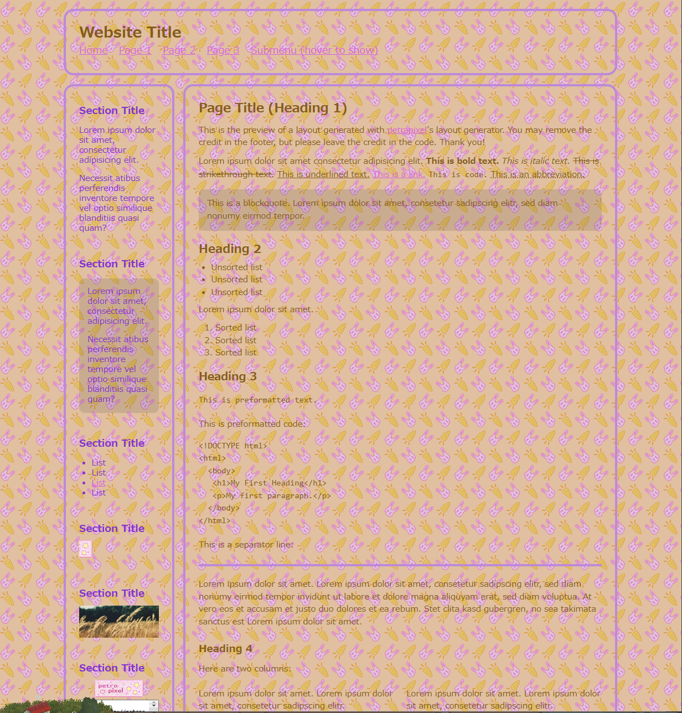
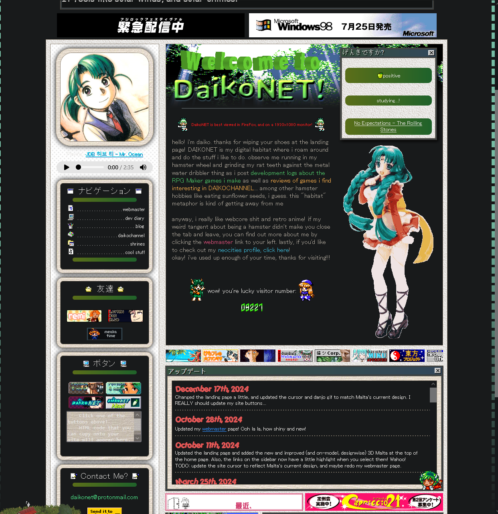
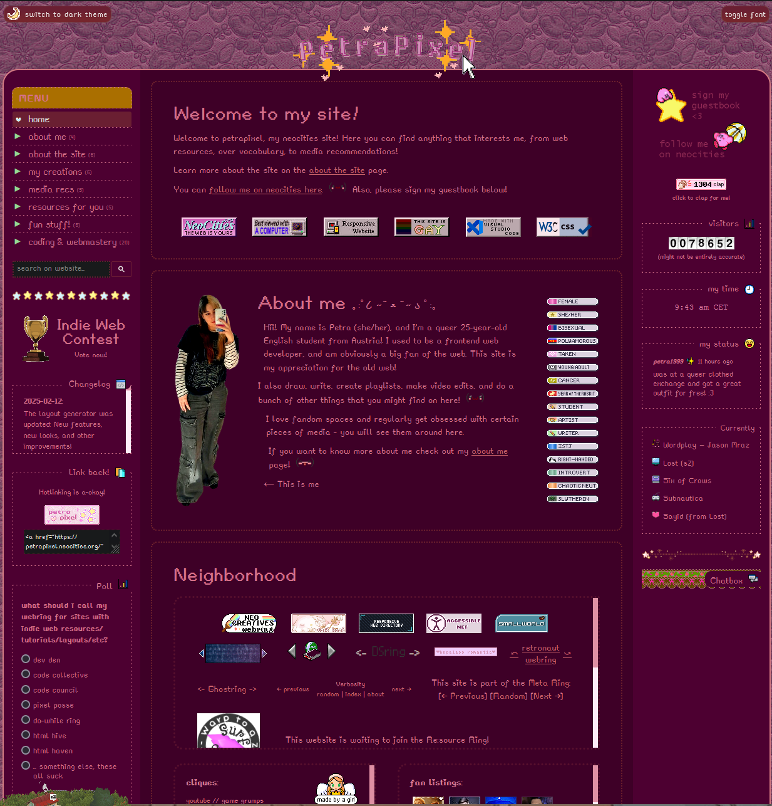

TODO and implementations

#### Layout
1. Header, Footer, Leftsidebar Primary page right bar
Current setup:

Inspiration:

#### Cute widgets
1. Guestbook: https://www.smartgb.com/ - Reccomended by [petrapixel](https://petrapixel.neocities.org/coding/neocities) because after ~2022 you are not allowed to use external scripts, such as guestbooks, shoutboxes, status/mood widgets, and even hit counters unless they are iFrames.
2. Status cafe - https://status.cafe/ and implementation. [Link to tool](https://status.cafe/current-status)
3. [Last.fm](https://github.com/biancarosa/lastfm-last-played)
4. [Discord](https://widgets.vendicated.dev/)